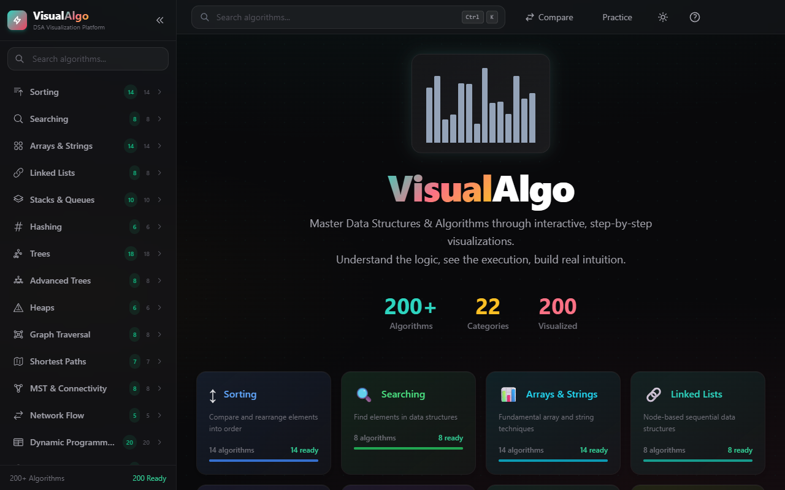
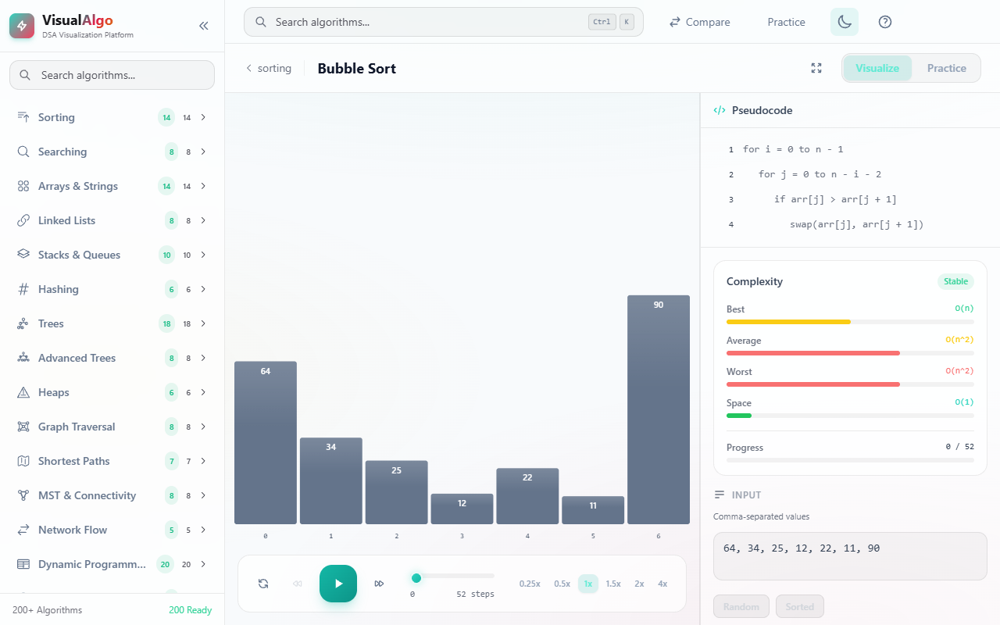
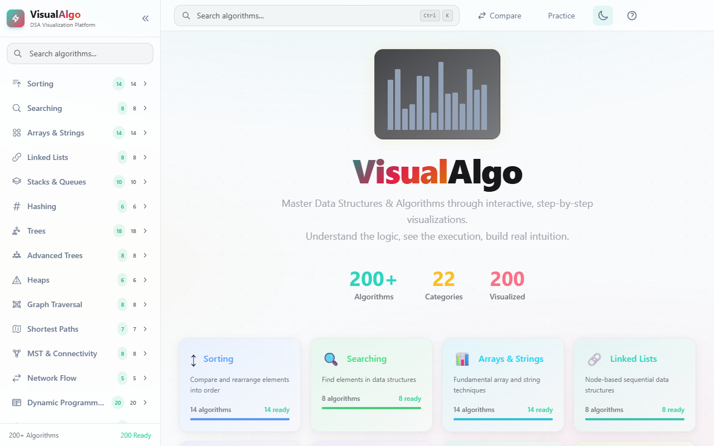
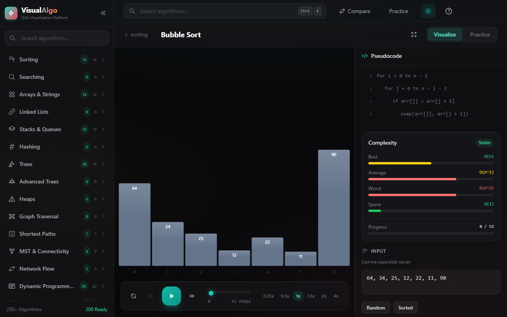
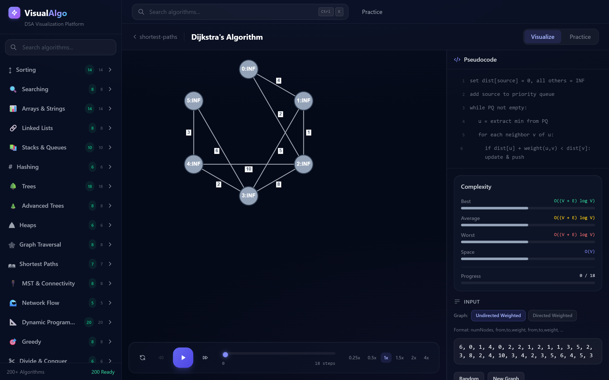
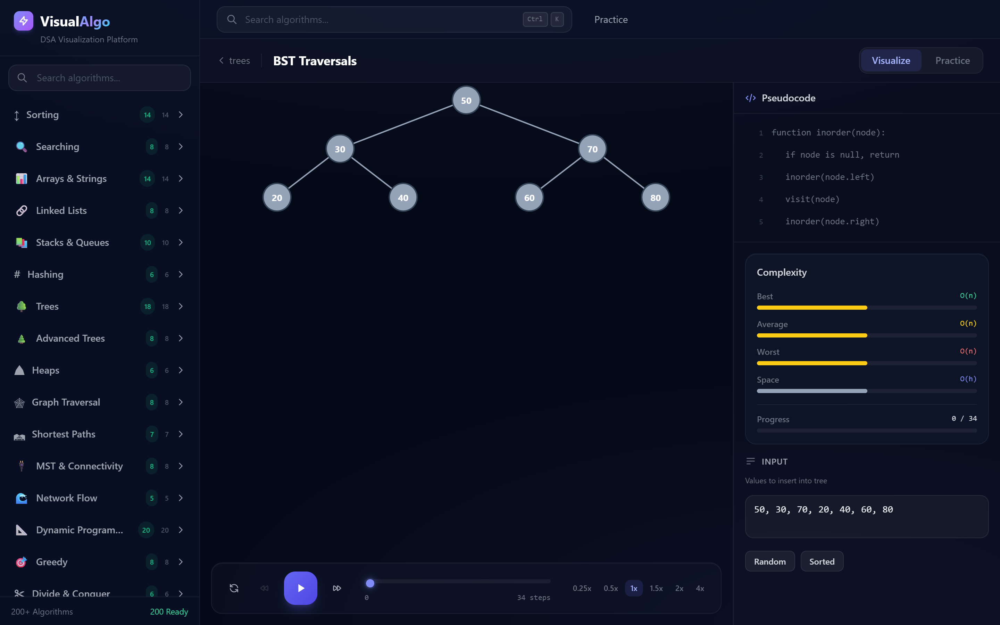

<p align="center">
  
</p>

<h1 align="center">VisualAlgo</h1>

<p align="center">
  <strong>See algorithms think. Step by step.</strong>
</p>

<p align="center">
  <a href="#-why-visualalgo">Why</a> &nbsp;&bull;&nbsp;
  <a href="#-screenshots">Screenshots</a> &nbsp;&bull;&nbsp;
  <a href="#-quick-start">Quick Start</a> &nbsp;&bull;&nbsp;
  <a href="#-all-algorithms">All Algorithms</a> &nbsp;&bull;&nbsp;
  <a href="#-add-your-own">Add Your Own</a>
</p>

<p align="center">
  
  
  
  
  
</p>

---

## Why VisualAlgo?

Reading pseudocode is not the same as understanding an algorithm. **VisualAlgo** lets you _watch_ algorithms run: see which elements get compared, where the recursion backtracks, how the graph colors propagate, and when the priority queue reorders. Every single operation is captured as a step you can play, pause, rewind, and inspect.

No accounts. No backend. No paywall. Just open it and learn.

---

## Screenshots

### Dark Theme

<p align="center">
  
  <br />
  <sub>Home dashboard with 22 categories, sidebar navigation, and glassmorphism cards.</sub>
</p>

<p align="center">
  
  <br />
  <sub>Algorithm visualization with playback controls, pseudocode highlighting, and complexity analysis.</sub>
</p>

### Light Theme

<p align="center">
  
  <br />
  <sub>Full light theme support — every element adapts for readability.</sub>
</p>

<p align="center">
  
  <br />
  <sub>Algorithm page in light mode with visible sidebar, inputs, and complexity bars.</sub>
</p>

### More Visualizations

<p align="center">
  
  <br />
  <sub>Dijkstra's shortest path on a weighted graph — nodes light up as visited.</sub>
</p>

<p align="center">
  
  <br />
  <sub>Binary tree insertions, deletions, and rotations — visualized node by node.</sub>
</p>

---

## Key Features

| Feature | Details |
|---------|---------|
| **Step-by-step playback** | Play, pause, step forward/back, or scrub to any point. Every operation captured. |
| **5 visualization renderers** | Bar charts, trees, graphs (directed/undirected/weighted), grids, linked lists. |
| **Live pseudocode sync** | Current line highlights in real time as the algorithm executes. |
| **Graph type switching** | Toggle Undirected / Directed / DAG / Weighted on the fly. Arrowheads update instantly. |
| **Random input generation** | One click generates valid random input for any algorithm. |
| **Keyboard-first** | `Space` play/pause, `Arrow keys` step, `R` reset. |
| **Complexity analysis** | Best, average, worst time + space shown with color-coded bars. |
| **Zero backend** | Pure client-side. Deploy anywhere as static files. |
| **Dark & Light Themes** | Toggle between dark and light themes. Every element adapts — sidebar, inputs, cards, complexity bars. |
| **Glassmorphism UI** | Frosted-glass panels, subtle gradients, professional styling in both themes. |

---

## Quick Start

```bash
# Clone
git clone https://github.com/your-username/VisualAlgo.git
cd VisualAlgo

# Install
npm install

# Run
npm run dev
```

Open **http://localhost:5173** — that's it.

### Production Build

```bash
npm run build        # Output in dist/
npm run preview      # Preview the build locally
```

Deploy `dist/` to Vercel, Netlify, GitHub Pages, or any static host.

---

## All Algorithms

22 categories. 200+ algorithms. Here's what's inside:

| Category | # | Highlights |
|----------|---|------------|
| **Sorting** | 14 | Bubble, Selection, Insertion, Merge, Quick, Heap, Counting, Radix, Bucket, Shell, Tim, Cocktail, Comb, Gnome |
| **Searching** | 8 | Binary, Ternary, Jump, Interpolation, Exponential, Fibonacci, Linear, Sentinel |
| **Arrays & Strings** | 14 | Kadane's, Sliding Window, Two Pointer, Prefix Sum, Dutch National Flag |
| **Linked Lists** | 8 | Reversal, Floyd's Cycle, LRU Cache, Merge Sort on LL |
| **Stacks & Queues** | 10 | Monotonic Stack, Next Greater Element, Min Stack, Circular Queue |
| **Hashing** | 6 | Chaining, Open Addressing, Cuckoo, Robin Hood, Bloom Filter |
| **Trees** | 18 | BST, AVL, Red-Black, Segment Tree, Fenwick, Trie, B-Tree |
| **Advanced Trees** | 8 | Binary Lifting, HLD, Centroid Decomposition, LCA |
| **Heaps** | 6 | Min/Max Heap, Fibonacci, Binomial, K-way Merge |
| **Graph Traversal** | 8 | BFS, DFS, Topological Sort, Bipartite Check, Cycle Detection |
| **Shortest Paths** | 7 | Dijkstra, Bellman-Ford, Floyd-Warshall, A*, Johnson's |
| **MST & Connectivity** | 8 | Kruskal, Prim, Tarjan SCC, Kosaraju, Bridges, Articulation Points |
| **Network Flow** | 5 | Ford-Fulkerson, Edmonds-Karp, Dinic's, Hopcroft-Karp, Hungarian |
| **Dynamic Programming** | 20 | Knapsack, LCS, LIS, Edit Distance, Matrix Chain, Bitmask DP |
| **Greedy** | 8 | Activity Selection, Huffman Coding, Job Sequencing, Fractional Knapsack |
| **Divide & Conquer** | 6 | Quick Select, Closest Pair, Strassen's, Karatsuba |
| **Backtracking** | 8 | N-Queens, Sudoku, Rat in Maze, Knight's Tour, Hamiltonian Path |
| **String Algorithms** | 10 | KMP, Rabin-Karp, Z-Function, Aho-Corasick, Suffix Array |
| **Computational Geometry** | 8 | Convex Hull, Sweep Line, Voronoi, Point in Polygon |
| **Number Theory** | 10 | Sieve, Miller-Rabin, Extended Euclidean, CRT, Euler's Totient |
| **Bit Manipulation** | 6 | XOR Tricks, Subset Enumeration, Bitwise Sieve, Bit DP |
| **Union-Find / DSU** | 4 | Union by Rank, Path Compression, Rollback DSU |

---

## Add Your Own

Every algorithm is a single file. Here's the template:

```javascript
// src/algorithms/sorting/mySort.js

export const meta = {
  name: 'My Sort',
  rendererType: 'bar',                          // 'bar' | 'tree' | 'graph' | 'grid'
  timeComplexity: { best: 'O(n)', average: 'O(n log n)', worst: 'O(n^2)' },
  spaceComplexity: 'O(1)',
  pseudocode: [
    'for i = 0 to n-1',
    '  find minimum in arr[i..n-1]',
    '  swap arr[i] and arr[min]',
  ],
};

export const defaultInput = [64, 34, 25, 12, 22, 11, 90];

export function generateSteps(input) {
  const arr = [...input];
  const steps = [];
  // ... your algorithm logic
  // Push a snapshot at each interesting step:
  // steps.push({ snapshot: { array: [...arr] }, indices: { compared: [i, j] }, codeLine: 1 });
  return steps;
}
```

Then register it in `src/data/algorithmRegistry.js` and it appears in the sidebar automatically.

### Input Formats

| Type | Format | Example |
|------|--------|---------|
| Array | Comma-separated values | `64, 34, 25, 12, 22` |
| Tree | Values to insert | `50, 30, 70, 20, 40` |
| Graph (unweighted) | `nodes, u,v, u,v, ...` | `6, 0,1, 0,2, 1,3` |
| Graph (weighted) | `nodes, u,v,w, u,v,w, ...` | `6, 0,1,4, 0,2,3` |
| Grid | `size, row values...` | `4, 1,0,1,0, 1,1,1,1` |

---

## Project Structure

```
src/
  algorithms/         # 200+ algorithm implementations
    sorting/           # 14 sorting algorithms
    searching/         # 8 search algorithms
    graph-traversal/   # BFS, DFS, topological sort
    shortest-paths/    # Dijkstra, Bellman-Ford, Floyd-Warshall
    dynamic-programming/
    ...                # 17 more categories

  components/
    visualization/     # Playback controls, renderer selection
    code/              # Pseudocode panel
    complexity/        # Complexity bars
    input/             # Input field, graph type selector
    layout/            # Sidebar, Header

  engine/
    renderers/         # Bar, Tree, Graph, Grid, LinkedList
    usePlayback.js     # Play/pause/step hook

  data/
    algorithmRegistry.js   # Master algorithm index
    categoryRegistry.js    # Category metadata
    practiceProblems.js    # Curated LeetCode problems
```

## Tech Stack

| Layer | Technology |
|-------|-----------|
| Framework | React 18 |
| Build | Vite 5 |
| Styling | Tailwind CSS with custom glassmorphism |
| Rendering | Canvas API (zero chart libraries) |
| Routing | React Router v6 |
| Deployment | Static — works on Vercel, Netlify, GH Pages |

---

## Keyboard Shortcuts

| Key | Action |
|-----|--------|
| `Space` | Play / Pause |
| `Right Arrow` | Step Forward |
| `Left Arrow` | Step Back |
| `R` | Reset to beginning |
| `Ctrl+K` | Focus search bar |

---

## Contributing

1. Fork and clone
2. Add your algorithm in `src/algorithms/<category>/`
3. Register it in `algorithmRegistry.js`
4. Run `npm run dev` and test the visualization
5. Open a PR

---

## License

MIT

<p align="center">
  <sub>Built for visual learners. No fluff, just algorithms.</sub>
</p>
